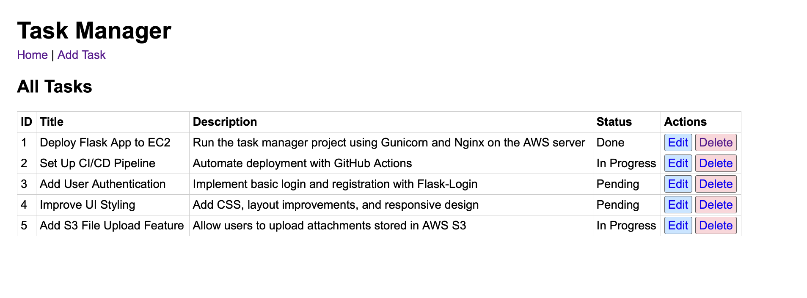
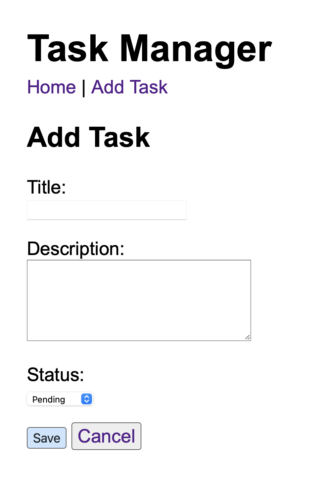

# Task Manager Web App (Cloud)

A simple Task Manager application built with **Flask** and **SQLite**, deployed on an **AWS EC2 Ubuntu instance** using **Gunicorn**.  
This project demonstrates cloud deployment, SSH, virtual environments, security groups, and hosting a Python web application on the cloud.

---

## Screenshots

### Home Page (All Tasks)


### ➕ Add Task Page


---

## How to Run Locally

```bash
git clone https://github.com/jeandway/task-manager-cloud.git
cd task-manager-cloud
python3 -m venv venv
source venv/bin/activate
pip install flask gunicorn
python app.py
```
## ☁️ Deployment Summary (AWS EC2)

- Launched an Ubuntu EC2 instance (t2.micro)
- Opened ports: 22 (SSH), 80 (HTTP), 5000 (Flask)
- Installed Python, pip, venv, sqlite3 on the server
- Copied project files from Mac → EC2 using SCP
- Created a virtual environment and installed dependencies
- Started the app with Gunicorn and served it publicly

## Architecture Diagram

```bash
Local Machine (Mac)
        ↓  SSH/SCP
AWS EC2 (Ubuntu)
        ↓  runs
Gunicorn (WSGI Server)
        ↓  serves
Flask App → SQLite Database (tasks.db)
```

